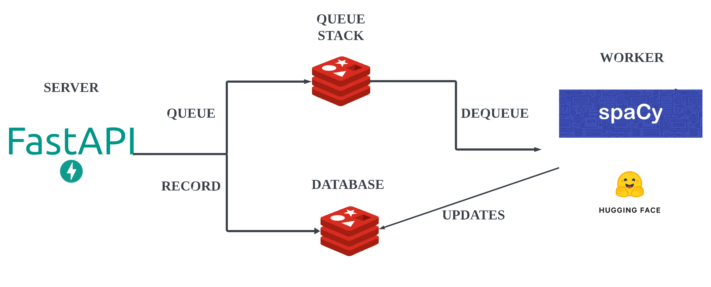

# Resume and Job Ad Parser

## Overview
Our project harnesses the power of advanced Natural Language Processing (NLP) to efficiently parse and analyze resumes and job advertisements. At its core, it utilizes SpaCy for sophisticated text processing and transformer models to grasp the context of the content accurately. Furthermore, HuggingFace's ZeroShotClassification is employed for the precise categorization of skills and requirements, ensuring high accuracy in parsing and analysis. __**The end goal is to extract out skills in job ads and resume.**__

## SYSTEM SETUP:

This backend uses two redis instance with one acting as msg queue and the other as nosql database. Fastapi is used as server to listen to request while a simple python script is used to dequeue and process requests.



###  Built as backend for localised browser extension
This backend is specifically engineered with browser extension in mind. Text data ingestion is simplified. The `text_chunk` endpoint is optimized to receive text selections directly from the user’s cursor on web pages. This feature is particularly useful for quickly capturing and processing job ads or resume data from various online sources.

### Understanding Results

As the backend is built for a localized browser extension, lightweight Redis NoSQL was used with disposability in mind. Results can be obtained from the `/jobs/{job_uid}` endpoint. For simple saving, each extracted detail is separated with a `<sep>` as a delimiter.


## Features
- **Resume Parsing**: Extracts key information from resumes.
- **Job Ad Analysis**: Analyzes job ads to identify essential qualifications and skills.
- **NLP Powered**: Uses SpaCy and transformer models for efficient text processing and analysis.
- **ZeroShotClassification**: Employs HuggingFace's technology for accurate categorization.

## Endpoints:

Post methods:

- `/text_chunks/` - uploads text chunks of job ads
- `/resume/` - uploads your resume

Get methods:

- `/jobs/` - get list of job uids
- `/jobs/{job_uid}` - get information pertaining to job uid


## Installation

1. Clone the repository:
```
    git clone https://github.com/PaulSZH95/buoy.git
```

2. Install [docker](https://docs.docker.com/engine/install/)

3. Install [Insonmia](https://docs.insomnia.rest/insomnia/install)

4. Locally ensure buoy folder is your working directory:
```
    $coder: pwd
    >>> /whatever_path/buoy/
```

5. declare abspath variable. In this example /whatever_path is /app/dev/
```
    $coder: pwd
    >>> /app/dev/buoy/
```
```
    powershell:
    $env:abspath = "/app/dev/"
```
```
    Linux:
    export abspath="/app/dev/"
```


6. Run docker compose up:
```
    docker compose up -d
```

7. Use Insonmia to call endpoint:

    submit job_ad with /text_chunk/ endpoint

    

    submit resume with /resume/ endpoint

    

    get list of submission uids with /jobs/ endpoint

    

    get details of job based on uid with /jobs/{job_uid} endpoint

    

Detailed Article Probably Coming Soon...